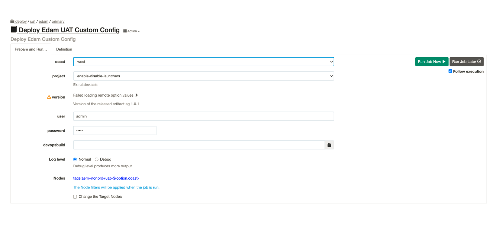
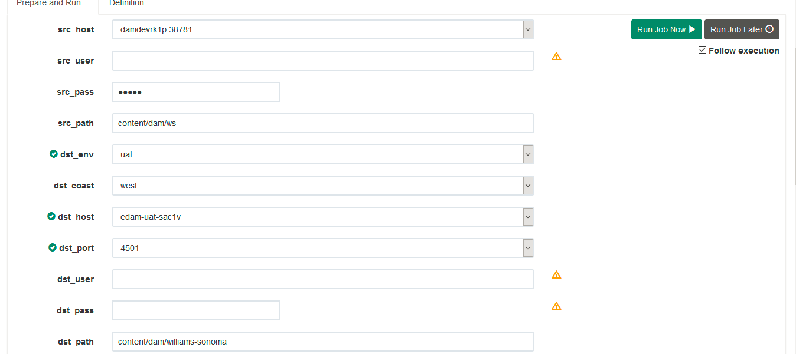
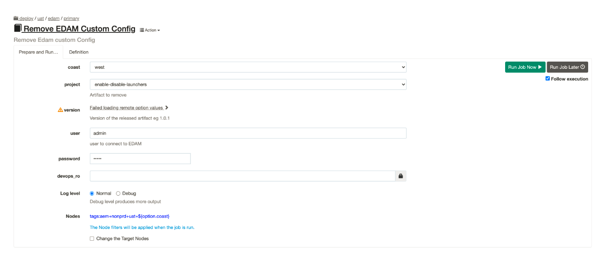
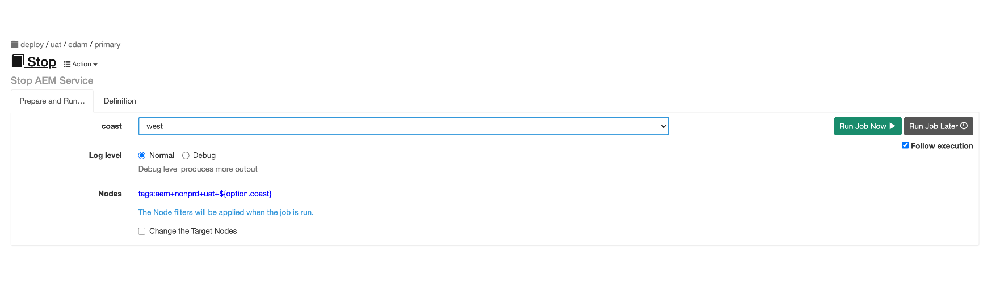
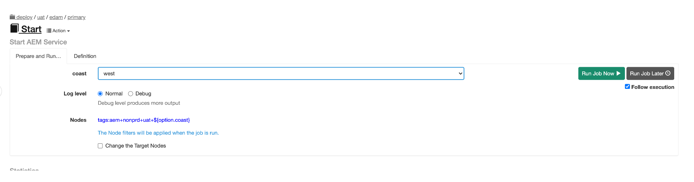

Phase-1.x WS Migration on West Coast - EDAM Deployment/Rollback Steps for UAT
=============================================================================

*   [1\. Take Snapshot of West Coast EDAM Server VM:](#1-take-snapshot-of-west-coast-edam-server-vm)
*   [2.Disable all DAM related Workflow launchers in EDAM  and enable Migration related Workflow launcher](#2-disable-all-dam-related-workflow-launchers-in-edamand-enable-migration-related-workflow-launcher)
*   [2.Trigger Rundeck job to migrate assets from legacy to EDAM](#2-trigger-rundeck-job-to-migrate-assets-from-legacy-to-edam)
*   [3.Enable all DAM related Workflow launchers in EDAM and disable Migration related Workflow launcher](#3-enable-all-dam-related-workflow-launchers-in-edam-and-disable-migration-related-workflow-launcher)
*   [4\. Stop AEM Instance](#4-stop-aem-instance)
*   [5.  Start AEM instance](#5-start-aem-instance)
*   [Validation checklist: EDAM 1.x - West- Validation Checklist](#validation-checklist)

·  [Rollback Step](#rollback-step)

# 1 Take Snapshot of West Coast EDAM Server VM
---------------------------------------------------

Project team to raise a WSI SNOW ticket to take a snapshot of west coast UAT server VM before deployment begins.

  **For Server details please refer the following URL:****  
**[EDAM - CNAME](/display/PS/EDAM+-+CNAME)****

# 2 Disable all DAM related Workflow launchers in EDAM and enable Migration related Workflow launcher
--------------------------------------------------------------------------------------------------------

This step disables the required launchers and enables the post migration launcher

**Source** : [https://github.wsgc.com/eCommerce-DevOps/edam-common-config/tree/release/edam/enable-disable-launchers](https://github.wsgc.com/eCommerce-DevOps/edam-common-config/tree/release/edam/enable-disable-launchers)  
**Destination**: **/conf**

1.  Go to Rundeck job: 
2.  UAT: [https://rundeck.wsgc.com/rundeck/project/wsgc/job/show/deploy-uat-edam-custom-primary](https://rundeck.wsgc.com/rundeck/project/wsgc/job/show/deploy-uat-edam-custom-primary)
3.  Select Coast : 'west'
4.  Select 'enable-disable-launcher' from drop down for project/type
5.  Provide version Eg:  '1.0.2'
6.  Enter AEM admin password
7.  Click 'Run Job Now' button
8.  Verify logs and wait until job get finished 
9.  It takes ~ 2 min
10.  Enter URL  on the browser, enter admin credentials
11.  UAT: [aemsac-vicn003.wsgc.com](http://aemsac-vicn003.wsgc.com/):4501/libs/cq/workflow/admin/console/content/launchers.html
12.  Verify all launchers should be disabled and post migration launcher should be enabled
13.   It takes ~ 5 minutes time

# 2 Trigger Rundeck job to migrate assets from legacy to EDAM 
---------------------------------------------------------------

Rundeck URL: [https://rundeck.wsgc.com/rundeck/project/wsgc/job/show/edam-asset-migration-nonprd](https://rundeck.wsgc.com/rundeck/project/wsgc/job/show/edam-asset-migration-nonprd)

Steps:

Step 1: Please hit the rundeck URL on the browser

Step 2:  please provide following fields:  
src\_host : damdevrk1p:38781

src\_user : Enter user name who is having access to asset paths

src\_pass: Enter password which is associated the user which entered in above field

src\_path: Enter src path like content/dam/ws for williams-sonoma and content/dam/wsh for williams-sonoma-home

dst\_env : select environment as  uat

dst\_coast: select coast as west

dst\_host:  this will auto populate based on environment selection no action required here

dst\_port: 4501, default port populate as 4501, no action required.

dst\_user: Enter user name who is having access to asset paths

dst\_password: Enter password which is associated the user which entered in above field

dst\_path: Enter content/dam/williams-sonoma for williams-sonoma and content/dam/williams-sonoma/williams-sonoma-home for williams-sonoma-home

crx\_path: Enter crx-quickstart path where crx-quickstart folder installed, ex: /apps/edam/primary/crx-quickstart

batch\_size : Default value 1000 will auto populate no action required

auto: false : every this should be false no action required

Log Level: Default check box is normal no action required.

Step 3: Click the run job now button and monitor the logs

Step 4:  Once job completes, please compare the assets with Legacy dam server with EDAM server.

5: It takes 48 hours-72 hours of time

# 3 Enable all DAM related Workflow launchers in EDAM and disable Migration related Workflow launcher
-------------------------------------------------------------------------------------------------------

This step enables the required launchers and disables the post migration launcher

**Source** : [https://github.wsgc.com/eCommerce-DevOps/edam-common-config/tree/release/edam/enable-disable-launchers](https://github.wsgc.com/eCommerce-DevOps/edam-common-config/tree/release/edam/enable-disable-launchers)  
**Destination**: **/conf**

1.  Go to Rundeck job: 
2.  UAT: [https://rundeck.wsgc.com/rundeck/project/wsgc/job/show/2800d819-d92e-47e2-b52e-63b08360fced](https://rundeck.wsgc.com/rundeck/project/wsgc/job/show/2800d819-d92e-47e2-b52e-63b08360fced)
3.  Select Coast : 'west'
4.  Select 'enable-disable-launcher' from drop down for project/type
5.  Provide version Eg:  '1.0.2'
6.  Enter AEM admin password
7.  Click 'Run Job Now' button
8.  Verify logs and wait until job get finished 
9.  It takes ~ 2 min
10.  Enter URL  on the browser, enter admin credentials
11.  UAT: [aemsac-vicn003.wsgc.com](http://aemsac-vicn003.wsgc.com/):4501/libs/cq/workflow/admin/console/content/launchers.html
12.  Verify all launchers should be disabled and post migration launcher should be enabled
13.   It takes ~ 5 minutes time

# 4 Stop AEM Instance 
-------------------------

**Source: [https://github.wsgc.com/eCommerce-DevOps/aem-edam-common-config/blob/master/src/main/resources/apps/aemscripts/stop](https://github.wsgc.com/eCommerce-DevOps/aem-edam-common-config/blob/master/src/main/resources/apps/aemscripts/start)**  
This step stop the AEM server

Rundeck Job URL: [https://rundeck.wsgc.com/rundeck/project/wsgc/job/show/c896c5ea-8736-46cf-bb03-77265dd16316](https://rundeck.wsgc.com/rundeck/project/wsgc/job/show/c896c5ea-8736-46cf-bb03-77265dd16316)

1.  Go to Rundeck job
2.  Select 'coast:west'
3.  Click 'Run Job Now' button
4.  Verify logs and wait until job get finished 
5.  It takes ~5 min
6.  Verify by entering following  URL  on the browser.
7.  UAT: [aemsac-vicn003.wsgc.com](http://aemsac-vicn003.wsgc.com):4501/

# 5 Start AEM instance
--------------------------

**Source: [https://github.wsgc.com/eCommerce-DevOps/aem-edam-common-config/blob/master/src/main/resources/apps/aemscripts/start](https://github.wsgc.com/eCommerce-DevOps/aem-edam-common-config/blob/master/src/main/resources/apps/aemscripts/start)**  
This step starts the AEM server in primary mode

1.  Go to Rundeck job:
2.  UAT: [https://rundeck.wsgc.com/rundeck/project/wsgc/job/show/wsgc-deploy-uat-edam-primary-start](https://rundeck.wsgc.com/rundeck/project/wsgc/job/show/wsgc-deploy-uat-edam-primary-start)
3.  Select 'coast:west '
4.  Click 'Run Job Now' button
5.  Verify logs and wait until job get finished 
6.  It takes ~10 min
7.  Verify by entering following  URL  on the browser.
8.  UAT: [aemsac-vicn003.wsgc.com](http://aemsac-vicn003.wsgc.com):4501/

# Validation checklist: 

[EDAM 1.x - West- Validation Checklist](https://confluence.wsgc.com/display/PdM/EDAM+1.x+-+West-+Validation+Checklist)**
---------------------------------------------------------------------------------------------------------------------

# Rollback Step
=================

Restore from VM backup snapshot (step #1 of deployment - [Phase-1.x WS Migration on West Coast - EDAM Deployment/Rollback Steps for UAT#1.TakeSnapshotofWestCoastEDAMServerVM](https://confluence.wsgc.com/pages/viewpage.action?pageId=284238230#Phase1.xWSMigrationonWestCoastEDAMDeployment/RollbackStepsforUAT-1.TakeSnapshotofWestCoastEDAMServerVM):)
